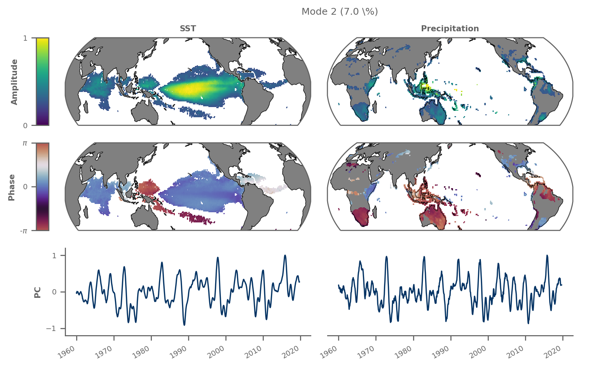

# xMCA | Maximum Covariance Analysis in Python

The aim of this package is to provide a flexible tool for the climate science community to perform Maximum Covariance Analysis (**MCA**) in a simple and consistent way. Given the huge popularity of [`xarray`][xarray] in the climate science community, the `xmca` package supports `xarray.DataArray` as well as `numpy.ndarray` as input formats.

*Mode 2 of complex rotated Maximum Covariance Analysis showing the shared dynamics of SST and continental precipitation associated to ENSO between 1980 and 2020.*

## What is MCA?
MCA maximises the temporal covariance between two different
data fields and is closely related to Principal Component Analysis (**PCA**) / Empirical
Orthogonal Function analysis (**EOF analysis**). While EOF analysis maximises the variance within a single data
field, MCA allows to extract the dominant co-varying patterns between two different data
fields. When the two input fields are the same, MCA reduces to standard EOF analysis.

For the mathematical understanding please have a look at e.g. the [lecture material][mca-material] written by C. Bretherton.

## New in release 0.3.4
- correct and consistent use of definition of loadings

## Core Features

|              	| Standard 	| Rotated 	| Complex 	| Complex Rotated 	|
|--------------	|----------	|----------	|---------	|------------------	|
| EOF analysis 	|[:heavy_check_mark:][pca]|[:heavy_check_mark:][rotated-pca]|[:heavy_check_mark:][complex-pca]|[:heavy_check_mark:][crpca]|
| MCA          	|[:heavy_check_mark:][mca]|[:heavy_check_mark:][rotated-mca]|[:heavy_check_mark:][xmca]|[:heavy_check_mark:][xmca]|

\* *click on check marks for reference* \
\** *A paper featuring complex (rotated) MCA has been submitted and is currently under review. However, you can already check a pre-print on [arXiv][xmca].*

## Installation \& Quickstart
Please have a look at the [documentation page](https://pyxmca.readthedocs.io/en/latest/index.html) for instructions on how to install and some examples to get started.

## Please cite
I am just starting my career as a scientist. Feedback on my scientific work is therefore important to me in order to assess which of my work advances the scientific community. As such, if you use the package for your own research and find it helpful, I would appreciate feedback here on [Github](https://github.com/nicrie/xmca/issues/new), via [email](mailto:niclasrieger@gmail.com), or as a [citation](http://doi.org/10.5281/zenodo.4749830):

Niclas Rieger, 2021: nicrie/xmca: version x.y.z. doi:[10.5281/zenodo.4749830](https://doi.org/10.5281/zenodo.4749830).

## Credits
Kudos to the developers and contributors of the following Github projects which I initially used myself and used as an inspiration:

* [ajdawson/eofs](https://github.com/ajdawson/eofs)
* [Yefee/xMCA](https://github.com/Yefee/xMCA)

[xarray]: http://xarray.pydata.org/en/stable/

[cartopy]: https://scitools.org.uk/cartopy/docs/latest/installing.html

[pca]: https://en.wikipedia.org/wiki/Empirical_orthogonal_functions

[mca]: ftp://eos.atmos.washington.edu/pub/breth/papers/1992/SVD-theory.pdf

[mca-material]: https://atmos.washington.edu/~breth/classes/AS552/lect/lect22.pdf

[rotated-pca]: https://climatedataguide.ucar.edu/climate-data-tools-and-analysis/empirical-orthogonal-function-eof-analysis-and-rotated-eof-analysis

[rotated-mca]: https://journals.ametsoc.org/jcli/article/8/11/2631/35764/Orthogonal-Rotation-of-Spatial-Patterns-Derived

[varimax]: https://en.wikipedia.org/wiki/Varimax_rotation

[promax]: https://bpspsychub.onlinelibrary.wiley.com/doi/abs/10.1111/j.2044-8317.1964.tb00244.x

[complex-pca]: https://journals.ametsoc.org/doi/abs/10.1175/1520-0450(1984)023%3C1660%3ACPCATA%3E2.0.CO%3B2

[crpca]: https://rmets.onlinelibrary.wiley.com/doi/abs/10.1002/joc.3370140706

[theta]: https://linkinghub.elsevier.com/retrieve/pii/S0169207016300243

[xmca]: https://arxiv.org/abs/2105.04618
